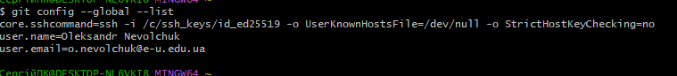
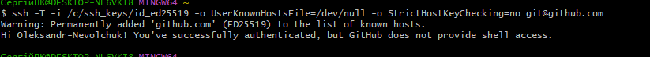
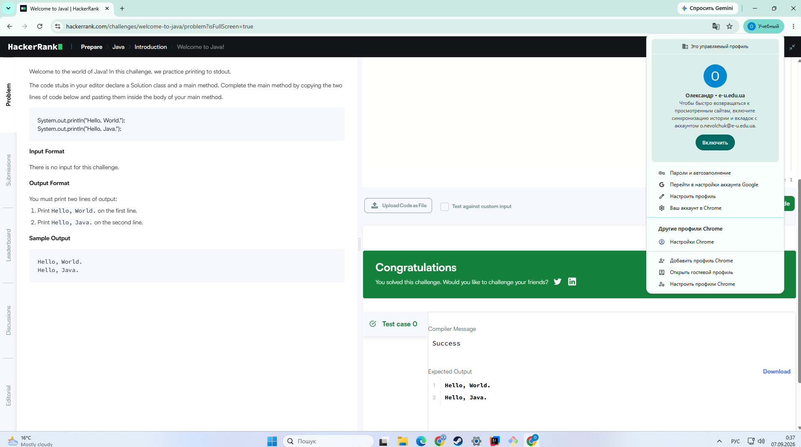
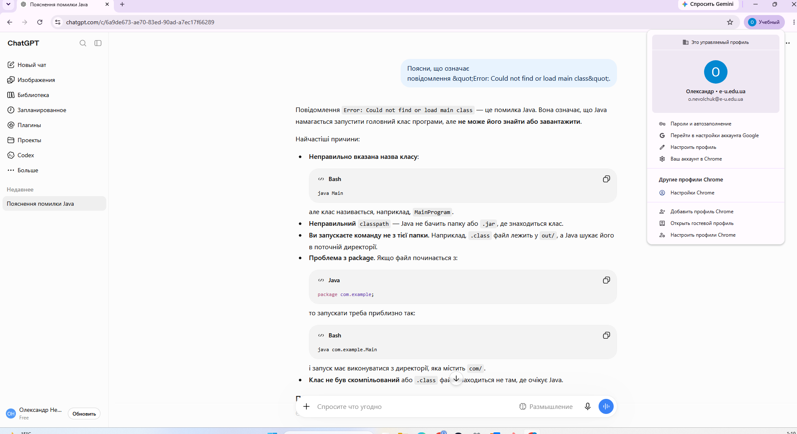

# aop-practice-0

Олександр Невольчук
Комп'ютерні науки денна онлайн 312

### Профілі:
* [GitHub] https://github.com/Oleksandr-Nevolchuk
* [LeetCode] https://leetcode.com/u/OleksandrNevolchuk/
* [HackerRank] https://www.hackerrank.com/profile/o_nevolchuk

### Версії інструментів:
* Java: openjdk 25.04.1
* Javac: 25.04.1
* Git: 2.55.0.windows.5
* ###  Знімок екрана з результатом команд java -version, javac -version, git --version, git config --global --list

###  Знімок екрана з результатом команди ssh -T git@github.com

###  Знімок екрана вікна IntelliJ IDEA з успішно виконаною програмою Hello, World!
[Перевірка автентифікації SSH](Screens/intelliy_idea.png)

###  Знімок екрана з розв'язаною задачею Welcome to Java! на HackerRank

###  Знімок екрана з відповіддю ChatGPT на навчальний запит

#Доступ до Claude Code не оформлювався

#Проблема: Кирилиця в імені користувача блокувала SSH.
#Спосіб усунення проблем:
1. Папку для збереження ключів було примусово створено в нейтральному англомовному каталозі на диску C: `/c/ssh_keys/`.
2. SSH-ключ згенеровано безпосередньо в цю папку: `/c/ssh_keys/id_ed25519`.
3. Глобальну конфігурацію Git було перевизначено командою, яка змушує Git завжди використовувати прямий шлях до цього файлу ключа, ігноруючи системні збої домашньої директорії:  
   `git config --global core.sshCommand "ssh -i /c/ssh_keys/id_ed25519 -o UserKnownHostsFile=/dev/null -o StrictHostKeyChecking=no"`